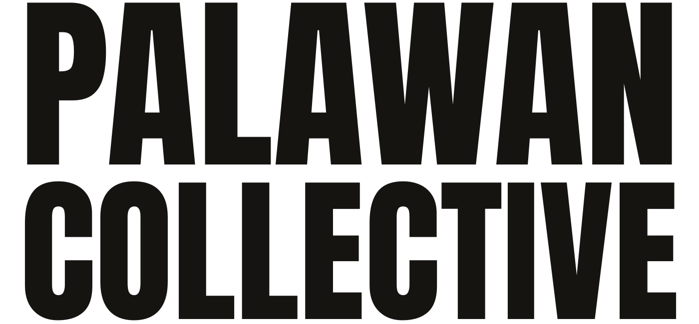

<p align="center">
  <picture>
    <source media="(prefers-color-scheme: dark)" srcset="public/images/palawan-collective-wordmark-light.svg">
    
  </picture>
</p>

<p align="center">
  <em>Stories, systems, and infrastructure from building off-grid resorts and<br>
  automation ecosystems in Palawan.</em>
</p>

<p align="center">
  <a href="https://nextjs.org"></a>
  <a href="https://react.dev"></a>
  <a href="https://www.typescriptlang.org"></a>
  <a href="https://orm.drizzle.team"></a>
  <a href="https://www.postgresql.org"></a>
  <a href="https://tailwindcss.com"></a>
</p>

---

A living field-journal website — not a portfolio, not a blog. It publishes
dispatches from an off-grid resort build, runs a WhatsApp-first AI operator,
and carries a hidden ops console for managing every part of the site.

**What's in the box**

- **Public site** — home with an ops-controlled section order (hero → **Dream
  Team** → status strip → built → stories → …), dispatch journal (`/stories`),
  built environments (`/built`), practical guides (`/palawan`), services +
  inquiry form (`/work-with-us`), newsletter, RSS (`/feed.xml`), sitemap,
  robots and full OpenGraph metadata.
- **Dream Team** — a database-backed roster under the hero: photo, role,
  location, short description, order, visibility. Managed in the console, no
  deploy needed (see [Dream Team](#dream-team-home-page)).
- **Ops console** — a hidden `/admin` surface with 21 panels: content builder,
  live design tokens, media library, navigation, newsletter, FAQ, galleries,
  AI agents, model routing, settings, social links, logo, partners, site
  images, the journal entries, the collections and the Dream Team.
- **AI operator** — chat endpoint that routes between OpenRouter (cloud) and
  Ollama (local) with a model catalog and a fallback knowledge base.
- **One backend** — a single `DATABASE_URL` (Neon-ready Postgres). Content
  seeds itself on first use, uploads live **in the database**, and every admin
  save is snapshot-able and one click to restore.

## Tech stack

| Layer | Technology | How it's used |
| ----- | ---------- | ------------- |
| Framework | **Next.js 16** (App Router, Turbopack) + **React 19** | Server components for content pages, route handlers for all APIs, `force-dynamic` admin surface |
| Language | **TypeScript 5.9** (strict) | Shared types from `src/db/schema.ts` flow through data layer into UI |
| Styling | **Tailwind CSS 4** + CSS variables | Design tokens are CSS custom properties, so the console restyles the site live |
| Motion | **Framer Motion 13** | Hero carousel, section reveals, unlock modal, console transitions |
| Database | **PostgreSQL** (Neon) via **Drizzle ORM 0.45** + `pg` pool | Schema in `src/db/schema.ts`, applied with `drizzle-kit push` |
| Auth | **jose** (HS256 JWT) | Stealth console sessions — httpOnly cookie **and** Bearer token, 30 min idle expiry |
| AI | **OpenRouter** ↔ **Ollama** | Cloud/local model routing, catalog refresh, behavior rules, fallback KB |
| Media | **sharp**, **qrcode** | Upload optimization for logos/media, footer WhatsApp QR |
| Client state | **Zustand 5** | Console store (`src/lib/admin-store.ts`) for panels + token mirror |
| Tooling | **ESLint 9**, `tsc --noEmit`, npm scripts | `npm run lint` / `npm run typecheck` before you ship |

## Quick start

```bash
# 1 · requirements — Node 20.9+ (22 LTS recommended) and a Postgres database
#                 (Neon free tier is plenty; see DEPLOY.md)

cp .env.example .env          # 2 · fill in DATABASE_URL + the admin values
npm install                   # 3
npm run db:setup              # 4 · create + verify the schema in your database
npm run dev                   # 5 · → http://localhost:3000
```

> No terminal on the machine holding your Neon keys? Open the Neon **SQL
> Editor**, paste the contents of [`drizzle/0000_initial.sql`](./drizzle/0000_initial.sql)
> and run it — same result as `npm run db:setup`.

`db:setup` is safe to re-run: it applies the schema when the database is empty,
reports what it found when it isn't, and prints a summary of your tables and
seeded content so you always know which database you're pointed at.

Content (stories, builds, guides, FAQs, partners, agents, design tokens)
seeds itself automatically on first use — no data setup required.

### Environment

Copy `.env.example` → `.env` (git-ignored) and fill it in:

| Variable | Required | Notes |
| -------- | -------- | ----- |
| `DATABASE_URL` | yes | Neon **pooled** connection string (host contains `-pooler`), or a local Postgres URL |
| `ADMIN_PASSKEY` | yes in production | Credential that unlocks the ops console — **set your own value** |
| `ADMIN_JWT_SECRET` | yes in production | Long random string that signs the session JWT; generate with `node -e "console.log(require('crypto').randomBytes(32).toString('hex'))"` |
| `OPENROUTER_API_KEY` | for cloud agents | Can also be pasted in the console under Models |
| `OLLAMA_BASE_URL` | for local models | Host running `ollama` (defaults to `http://127.0.0.1:11434`) |
| `NEXT_PUBLIC_WHATSAPP_NUMBER` | yes | Shown on site and used in WhatsApp links |
| `NEXT_PUBLIC_CONTACT_EMAIL` | yes | Shown in footer and forms |
| `NEXT_PUBLIC_SITE_URL` | yes | Canonical URLs, sitemap, OpenGraph |

### Admin setup

The ops console is part of the setup, but it is never linked from the public
site: `/admin` renders a locked screen with a single credential prompt, and
there is no login page to find anywhere else.

1. **Set the credentials** in `.env` before you deploy: `ADMIN_PASSKEY` (choose
   your own value) and `ADMIN_JWT_SECRET` (a long random string). Both must be
   present in your host's environment variables too — see
   [DEPLOY.md](./DEPLOY.md).
2. **Open the console** at `/admin`, or by using the discreet *Admin* control
   in the footer, or by triple-clicking the site logo.
3. **Unlock it** with the value you put in `ADMIN_PASSKEY`. Sessions refresh on
   activity and expire after 30 minutes idle (12 hour absolute cap), so the
   console locks itself when you walk away.
4. **Change anything.** Every panel writes straight to Postgres and the public
   site picks it up on the next request; every save snapshots the previous
   state, so *Version history → Restore* undoes mistakes in one click.

`/admin` is `noindex`, excluded in `robots.txt`, and its APIs are all JWT
guarded — nothing about the console is discoverable or crawlable.

## Ops console panels

One panel per surface, codes `00`–`20` (the sidebar and the `OpsView` union in
`src/lib/admin-store.ts` are the authority — this table mirrors them).

| Code | Section | What it controls |
| ---- | ------- | ---------------- |
| 00 | Overview | Stats, traffic, inquiries, model routing, version history |
| 01 | Site images | Hero carousel slides + per-page header photos |
| 02 | Content Builder | Homepage sections: order, visibility, drafts, content fields |
| 03 | Stories | Dispatch journal: list + `[slug]` entries |
| 04 | Built | Built environments: list + `[slug]` entries |
| 05 | Palawan | Practical guides: list + `[slug]` entries |
| 06 | Systems | The “Systems We Build” collection |
| 07 | Work with us | The services list behind the inquiry form |
| 08 | Design System | Colors, Google Fonts, type/space scale, radius, shadows — live |
| 09 | Media Library | Upload (optimized), tag, delete |
| 10 | Navigation | Header menu items |
| 11 | Newsletter | Copy, subscriber list, CSV export, provider hook |
| 12 | FAQ | Questions/answers, order, visibility |
| 13 | Galleries | Home gallery, items, layout |
| 14 | Agents | Create/start/stop AI agents, prompts, behavior rules, test bench |
| 15 | Models | OpenRouter (cloud) ↔ Ollama (local) routing, key, model catalog |
| 16 | Settings | Site identity, hero copy, contact, inquiries inbox, version history |
| 17 | Social | Social profile links (GitHub, X, Instagram, …) |
| 18 | Logo | Site logo upload + per-surface sizes (hero/header/footer) |
| 19 | Partners | Partner wall: add/edit/delete logos, links, order |
| 20 | Dream team | The roster on the home page: photo, role, location, description, order |

## Dream Team (home page)

The block straight after the hero is a live roster, not markup. One row per
person in `team_members`, so the whole thing moves without a deploy:

```
name · role · location · photo · photo_alt · bio · url · position · visible
```

- **Add / edit / reorder / hide / delete** — Ops console → `20 · Dream team`.
  Every save snapshots first, so *Version history → Restore* undoes it.
- **Photos** either ship in `public/images/team/` (the seven bundled names are
  listed in `public/images/team/README.md`) or get uploaded from the panel —
  uploads land in Postgres and are served from `/uploads/…`, so they survive a
  redeploy. A card whose photo is missing renders the member's initials instead
  of a broken image.
- **The block itself** (heading, “§ 01” label, description, link) is edited in
  Content Builder → `Dream Team`; hide it there to take the whole wall offline.
- **Existing databases adopt it automatically.** The roster and its section row
  are added by a one-time claim (`seed:team` in `site_settings`) on the first
  request after deploy, and positions/`§` labels shift to make room after the
  hero. Deleting members or the block is never undone by a later cold start.
- **No database?** The home page still renders the bundled roster, the same
  fallback rule `lib/data.ts` uses for stories and builds.

## Code tree

```
.
├── .env.example                  # environment template (copy to .env)
├── DEPLOY.md                     # Neon + production deployment guide
├── drizzle.config.ts             # Drizzle Kit config — reads DATABASE_URL
├── drizzle/                      # generated SQL migrations (paste-able into Neon)
├── scripts/
│   └── db-setup.mjs              # `npm run db:setup` — create + verify the schema
├── eslint.config.mjs             # ESLint 9 flat config (next preset)
├── next.config.ts                # Next.js config
├── postcss.config.mjs            # Tailwind CSS 4 via PostCSS
├── package.json                  # scripts: dev / build / start / lint / typecheck
├── public/
│   └── images/
│       ├── palawan-collective-wordmark.svg       # dark-ink wordmark
│       ├── palawan-collective-wordmark-light.svg # light-ink (README / dark surfaces)
│       ├── team/                                 # Dream Team portraits (+ README listing expected names)
│       └── partners/                             # default partner logos (SVG)
└── src/
    ├── app/
    │   ├── page.tsx                  # home — ops-controlled section order
    │   ├── layout.tsx                # fonts, header/footer, runtime, chat
    │   ├── globals.css               # Tailwind layers + design-token variables
    │   ├── stories/                  # dispatches (list + [slug])
    │   ├── built/                    # built environments (list + [slug])
    │   ├── palawan/                  # practical guides (list + [slug])
    │   ├── work-with-us/             # services + inquiry form
    │   ├── admin/page.tsx            # ops console (credential-gated)
    │   ├── uploads/[...path]/        # serves /uploads/* with a file whitelist
    │   ├── feed.xml/ · sitemap.ts · robots.ts · icon.svg · not-found.tsx
    │   └── api/
    │       ├── health/               # liveness
    │       ├── track/                # analytics events
    │       ├── subscribe/            # newsletter signups
    │       ├── inquiries/            # project/partnership inquiries
    │       ├── agent/chat/           # public AI operator (provider routing)
    │       ├── public/site/          # public dynamic bundle (design/nav/etc.)
    │       └── admin/                # console APIs (JWT-guarded)
    │           ├── login · logout · session · overview
    │           ├── sections · navigation · faqs · galleries
    │           ├── design · media · logo
    │           ├── newsletter · settings · versions
    │           └── agents · model-config · models/refresh · catalog
    │               social · partners · team · inquiries · images

    ├── components/
    │   ├── home/                     # hero, carousel, section blocks, partners wall,
    │   │                             # Dream Team grid, status strip, field notes
    │   ├── site/                     # header, footer, mobile nav, logo
    │   ├── ops/                      # console shell, 21 panels, stealth login,
    │   │                             # agent chat, runtime, footer admin trigger
    │   ├── StoryBody · StoryCard · SocialLinks · SubscribeForm
    │   └── InquiryForm · AgentChat · RotatingBadge · PalawanClock · ui.tsx
    ├── content/
    │   ├── stories.ts                # seed dispatches
    │   └── ecosystem.ts              # seed builds, guides, field log
    ├── db/
    │   ├── index.ts                  # Neon-ready pg Pool + Drizzle client
    │   └── schema.ts                 # all tables (content + control layer)
    └── lib/
        ├── data.ts                   # public content queries (db → seed fallback)
        ├── control.ts                # admin data layer + idempotent seeding
        ├── models.ts                 # OpenRouter / Ollama clients + fallback KB
        ├── ops-auth.ts               # credential check + JWT session (dual transport)
        ├── admin-store.ts            # Zustand console state
        ├── design.ts                 # design tokens + Google Fonts helpers
        ├── content-shape.ts          # coercers for untrusted admin payloads
        ├── social.ts                 # social platform catalog
        ├── site.ts                   # site constants (contact, whatsapp, etc.)
        ├── storage.ts                # upload storage (Postgres-backed)
        └── format.ts                 # dates, seasons, dispatch numbering
```

`uploads/` (legacy disk uploads) is git-ignored and created only at runtime —
new uploads are stored in Postgres in the `uploaded_files` table.

## Database tables

| Group | Tables |
| ----- | ------ |
| Content | `stories`, `builds`, `guides`, `field_log`, `galleries`, `faqs`, `team_members` |
| Audience | `subscribers`, `inquiries`, `analytics_events` |
| Control | `site_settings`, `site_sections`, `design_tokens`, `media_assets`, `nav_items`, `social_links`, `partners`, `agents`, `model_config`, `content_versions`, `agent_logs`, `uploaded_files` |

## Scripts

| Command | What it does |
| ------- | ------------ |
| `npm run dev` | Start the dev server on `http://localhost:3000` |
| `npm run build` | Production build |
| `npm run start` | Serve the production build |
| `npm run lint` | ESLint over the repo |
| `npm run typecheck` | `tsc --noEmit` |
| `npm run db:setup` | Create + verify the schema (safe to re-run; friendly output) |
| `npm run db:push` | Sync `src/db/schema.ts` to the database (`drizzle-kit push --force`) |
| `npm run db:generate` | Write a versioned SQL migration into `drizzle/` |

## Deploy

Neon + Vercel, zero extra services: one `DATABASE_URL` drives everything and
uploads live in Postgres, so nothing is lost on redeploy. Full walkthrough —
env vars, schema push, smoke test — in **[DEPLOY.md](./DEPLOY.md)**.
